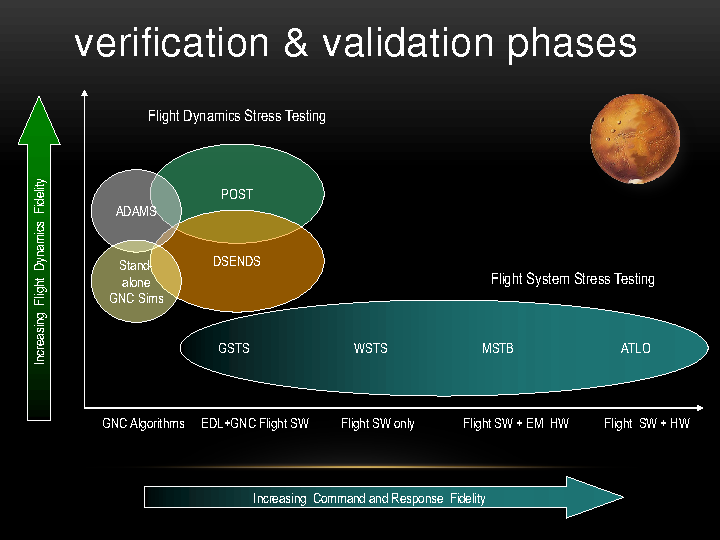
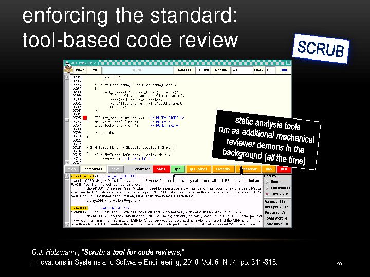

Dr. Gerard Holzmann spoke at USENIX Hot Topics in System Dependability mini-conf on 7 Oct 2012 in Hollywood, California. He described how NASA/JPL writes and tests software that survives rigors of interplanetary travel, planetary entry, descent, and landing, and operation in another world.

The following methods embody the state of the art in engineering robust software.

— Aleksey Tsalolikhin, October 2012  [http://www.verticalsysadmin.com/](http://www.verticalsysadmin.com/)

## About Dr. Holzmann

Dr. Holzmann is a foremost expert on software reliability. NASA hired Dr. Holzmann out of Bell Labs (after 24 years in that magical birthplace of UNIX) to solve its most difficult challenges in software. Dr. Holzmann heads JPL's Laboratory for Reliable Software (LARS).

In October 2012, NASA awarded Dr. Holzmann its Exceptional Engineering Achievement Medal "for exceptional and sustained achievement in developing and infusing advanced engineering practices for the verification of mission-critical software". ACM named Dr. Holzmann a Fellow in June 2012 "for contributions to software verification by model checking".

## The Rover

Dr. Holzmann described the Mars Science Laboratory (MSL) rover, known popularly as "Curiosity", as "basically a computer with very strange peripherals that has to do something that's never been done before".

MSL is part of a two-year, $2.5 billion mission investigating had microbial life existed on Mars. MSL is about the size of a small car and is the largest thing we've ever flown to Mars. It weighs 330 kg (730 pounds) on Mars and about twice that on Earth.

## Getting to Mars

Going from Earth to Mars was the easier part - NASA's done it before. There are currently 7 spacecraft on Mars. All 7 were landed by JPL. Two are still operating. It took Curiosity about 9 months to cross 350 million miles.

The rover came down almost in the center of the designated landing area (the Gale crater) - about the size of Hollywood, California. NASA sent Curiosity to the Gale crater to investigate an ancient riverbed for traces of life.

## The Challenge - How Do You Make Sure It All Works?

The heart of MSL is 3.8 million lines of software, equivalent to 60,000 pages of text, or 100 really large books (like Encyclopedia Britannica). This is about 6 times more code than was flown on the last mission, and is more than all the previous missions to Mars combined.

How do you make sure it all works without being able to practice it? For example, the landing (thruster-powered flight) has never been done before and cannot be tested in Earth's gravity.

## The Answer Starts with Simulation

JPL physically tested the rover in a vacuum chamber to simulate the inter-planetary environment, put it into a simulated Mars atmosphere, fried it to simulate Sun exposure; lots of this kind of physical testing was done by hundreds if not thousands of people.

A lot of the excellence at NASA has to do with accounting for failures in hardware. Adding redundancy can mitigate hardware failure. But what about the software?

Since NASA could not test on Mars, supercomputer clusters were used to simulate the environment and the hardware, and the software was very thoroughly tested.

Two types of tests were done:

- Flight dynamics testing. Flight dynamics deals with craft performance, stability, and control.
- Flight management system (FMS) stress testing. FMS is a specialized computer system that controls the flight plan.

Definitions for the bottom right part of the graph (the software):

**GNC**: Guidance, Navigation and Control.

**EDL**: Entry, Descent and Landing.

**GSTS**: Ground-based Surveillance and Tracking System. Supports the rover mission.

**WSTS**: Workstation Test Set. Software simulation environment, where all the hardware is simulated by software. Most of the testing was done here.

**MSTB**: Mission System Testbed. Some hardware is added, those testbeds are in high demand and are used 24 hours per day.

**ATLO**: Assembly, Test, and Launch Operations. All the hardware and software are put together and you do all the testing that you can before going into the production environment.

It took years to develop and test the flight software. There was a lot of hardware and software invested in simulating the Mars environment. The simulation was done on supercomputer clusters built on Dell hardware.

## The Software Engineering Team

The software engineering team was 40 strong. For comparison, about 2,000 people worked on this mission in total. There is a problem with the hardware? That's OK, "they can work around it in software". There was a lot of pressure on this relatively small team.

The development effort spanned 5 years. The team had only one customer, and only one use of its product: the software HAD to work the first time. Blue screen of death and reboot was not an option.

It was very difficult to test, because you don't have access to the production environment.

The production rate came out to about 10 lines of fully tested code per hour for the entire team.

Let me tell you more about the code and how NASA handled it.

## The Challenge - Parallel Environment Susceptible to Deadlocks

The code runs on 120 parallel threads on a VxWorks OS, customized to NASA's specifications by the vendor, WindRiver Systems (www.windriver.com). Race conditions and deadlocks were a major, major concern. This is where logical model verification of the source code came in handy - more on this soon.

The code is executed on 1 CPU (PowerPC RAD 750 running at 200 MHz) and there is 1 spare CPU, in case the 1st CPU breaks.

## The Challenge - Code Updates Are Hard to Make

Remember, there are 3.8 million lines of code. NASA can update it on the fly - for example this was done shortly before landing, when the final parameters for the landing software were uplinked.

Lots of people get nervous about making changes the closer you are to launch. It becomes very hard to make any changes, even if it is a bug fix.

So how did NASA get it all right?

## The Answer is Six-Fold

### Coding Standard

The team adopted a new, risk-based (not style-based!) CODING STANDARD with tool-based compliance checks.

Dr. Holzmann observed that Coding Standards are not actually followed by developers. Every mission at JPL had its own Coding Standard. Dr. Holzmann checked actual production code. For example, coding standard says every "switch" statement has to have a "default" case. grep "switch", grep "default", and you get wildly different numbers! Standards were not being followed.

So Dr. Holzmann said, suppose you could pick only 10 rules (as opposed to hundreds of rules that are ignored). Which rules would you pick? He interviewed a lot of people, including programming luminaries Brian Kernighan and Dennis Ritchie, and picked rules based on risk. This led to the "Power of Ten" coding rules, where every rule is related to a mishap or an accident or a loss of a mission that has happened to NASA.

Again, that's very few rules, with a bad case (example) of what happened when that rule was broken.

Thus the "The Power of 10: Rules for Developing Safety-Critical Code" was published in June 2006 issue of IEEE Computer Society "Computer" magazine. It is a small standard, easy to understand and remember; mechanically verifiable; and measurably effective.

The MSL mission's coding standard was based on "The Power of 10" standard. There were four distinct levels of compliance (LOC). There are 32 rules at LOC-4. Each level brings more rules.

For example, LOC-1 deals with Language Compliance. The target is zero warnings from static analyzers with all warnings turned on and in pedantic mode. NASA didn't quite get to that point with MSL, but next mission, Earth Orbiter, reached it.

LOC-2 deals with predictable execution, such as avoiding GOTOs and recursion.

LOC-3 deals with defensive coding, such as making the order of evaluation in compound expressions explicit.

LOC-4 deals with code clarity, such as making only very limited use of the C pre-processor, and forbidding redefinition of macros.

["JPL Institutional Coding Standard for the C Programming Language"](http://lars-lab.jpl.nasa.gov/JPL_Coding_Standard_C.pdf) details each LOC.

Tools automated the compliance checks. Reports of compliance checks fed into the code review process.

### Certification

Training and CERTIFICATION was mandatory for software developers. You could not touch flight code without having this certification. Even managers had to undergo training and certification.

### Static Source Code Analysis

Every night there was an integration build, combined with STATIC SOURCE CODE ANALYSIS, with penalties for breaking the build. Penalties would be having a Britney Spears poster on your cubicle for the day, or a LOLcat poster.

NASA ran 5 different static source code analyzers. They all have different strengths and warn about different things. LARS surveyed commercial and academic offerings and picked the top performers on flight code: Coverity, Code Sonar, KlocWork, Semil and Dr. Holzmann's own uno.

Warnings from the code analyzers are treated like peer comments in the peer code review. Warnings feed into the code review system.

### Code Review

Dr. Holzmann used a strongly tool-based Code Review process to make code review manageable at millions lines of code. Both static code analyzers and engineers' comments fed into the code review process.

Dr. Holzmann wrote the code review tool, SCRUB.

There was a single short meeting (60-90 min) for each of these modules to review the comments and the responses of the module owner. If the module owner does not respond, this is automatically marked as an agreement with the comment, and the module owner has to fix it. Agrees and disagrees are tracked; but only disagrees have to be discussed in a meeting.

The programs were written in C, because "better the devil you know".

Pragmas were not allowed, and again, this was enforced through automated compliance tests.

### Thorough Unit- and Integration Testing

For the first time, NASA had 100% code coverage with UNIT TESTS, covering every possible scenario. Every night, full INTEGRATION TEST suite would happen. About 3,000 C files would get compiled, (programs were written in C, because "better the devil you know") and the build logs were analyzed for errors. Results from unit- and integration tests as well as from the static source code analysis were fed into SCRUB for developers to review and fix.

The color coding green/yellow/red had a psychological effect. The software developers worked really hard to make all the buttons go green. Eighty percent of reports (peer- and tool-generated) led to a code fix.

The modules with the largest numbers of offenders got emailed out, shaming the offenders. Nobody wanted to be on that list.

### Logic Verification

NASA used Logic Verification of critical subsystems with a model checker. All the key subsystems where NASA was worried about race conditions, deadlocks, possibility of data corruption or data loss, underwent full blown logic verification using model checking.

Some subsystems were rewritten as a result. For example, the software team decided to redesign the data management subsystem because model checking found too many issues.

Verification is based on Pierre Wolper's "data independence" theorem. A program is data-independent if its behavior does not depend on the specific data it operates upon. Properties of programs are expressible in logic, and logic is used to verify the program.

The example Dr. Holzmann gave was verifying a lock-free fifo queue implementation for correctness.

Dr. Holzmann wanted to show that the implementation has the buffer property: no loss of items, no duplication, no reordering.

Dr. Holzmann wrote a tester, and a test harness. He used modex (model extractor) to extract the model from the implementation-level C code, and SPIN to verify and prove (in 3.6 seconds) that the model is correct and the algorithm works.

## Summary

NASA JPL LARS, led by Dr. Holzmann, increased chances of success of the MSL mission and built robust software using:

1. A workable, mechanically checkable CODING STANDARD.
2. Training and CERTIFICATION for the software team.
3. Extensive STATIC SOURCE CODE ANALYSIS followed by rolling up the sleeves and fixing every warning, with a pride in workmanship attitude.
4. A strongly tool-based CODE REVIEW process in an atmosphere of professionalism and pride in workmanship.
5. Thorough UNIT- AND INTEGRATION TESTING, with 100% unit-test coverage, in the professional attitude of: we are writing production code so we are going to test it, and we are going to test every scenario we can think of and then some!
6. LOGIC VERIFICATION of critical subsystems.

## MSL Still Going Strong

The MSL is still going strong after two incidents which caused the computer to go into "safe mode". The first was either a hardware problem or a radiation incident which affected memory and caused failover from computer A to computer B. The second was a software bug which led to a wrong file being deleted as part of regular housekeeping activities. The fix was straightforward and was applied and the MSL continues its investigation of life on Mars.

## Learning More

1. [The Power of Ten: 10 Rules for Writing Safety Critical Code](http://spinroot.com/p10/)
2. [Dr. Holzmann's CV details the many tools he's written for source code verification](http://spinroot.com/gerard/pdf/gjh_cv.pdf)
3. ["JPL Institutional Coding Standard for the C Programming Language" details the four levels of tool-enabled compliance checks](http://lars-lab.jpl.nasa.gov/JPL_Coding_Standard_C.pdf)
4. [Dr. Holzmann's modex (model extractor) extracts extract high-level verification models from implementation level C code](http://spinroot.com/modex/index.html)
5. [Dr. Holzmann's SPIN (Simple Promela INterpreter) then formally verifies these models](http://spinroot.com/spin/whatispin.html)
6. Pierre Wolper. 1986. Expressing interesting properties of programs in propositional temporal logic. In Proceedings of the 13th ACM SIGACT-SIGPLAN symposium on Principles of programming languages (POPL '86). ACM, New York, NY, USA, 184-193.
7. [Stephen Clark. "NASA conquers Curiosity computer concerns." SpaceFlightNow.com. 19 Mar 2013](http://www.spaceflightnow.com/mars/msl/130319safemode)
